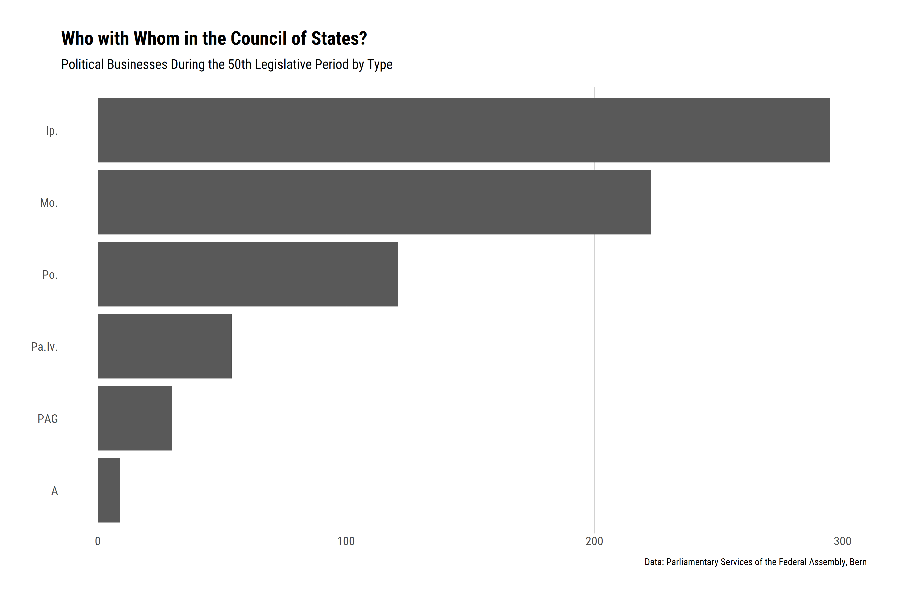
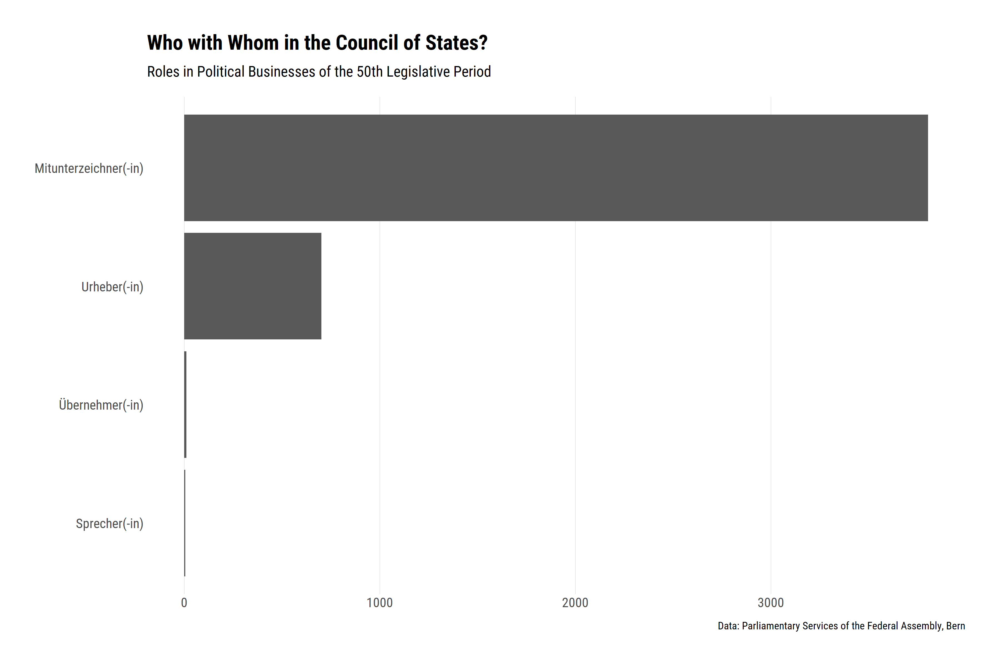
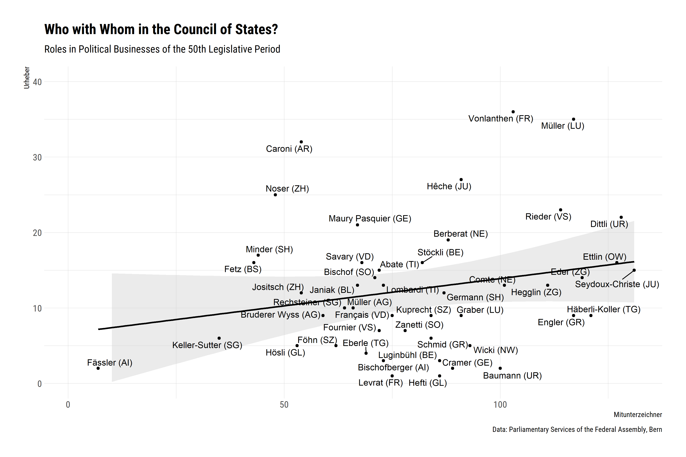
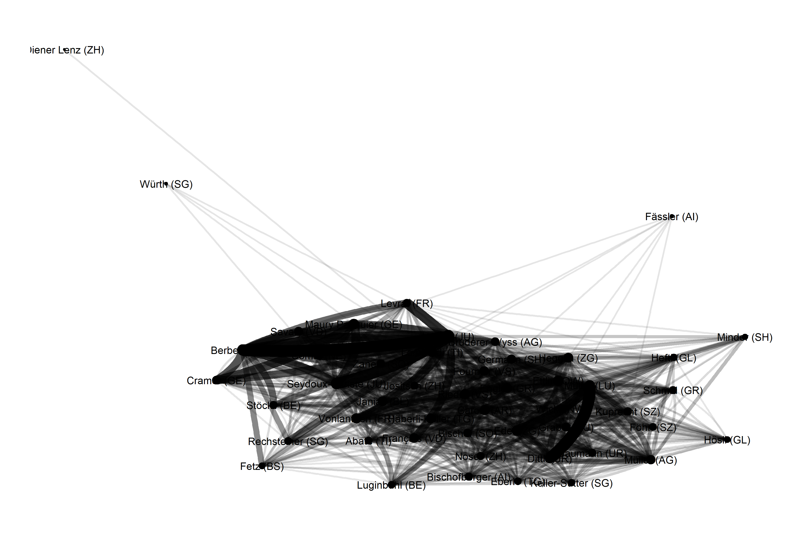
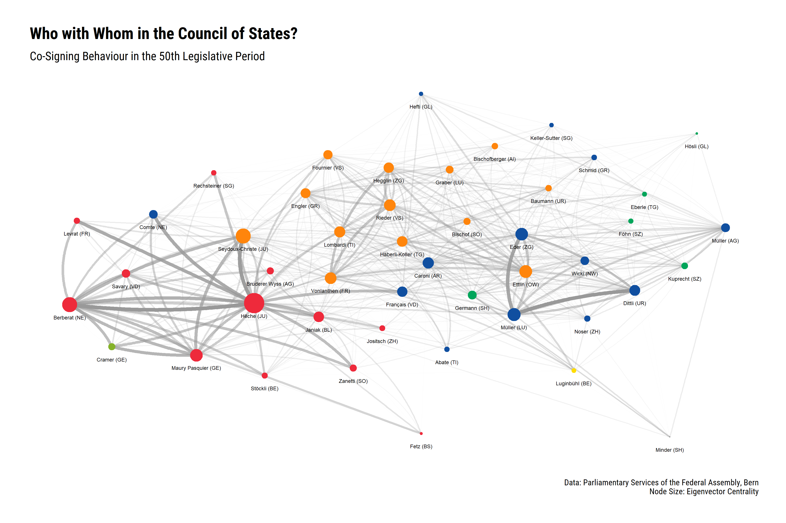

Who with Whom in the Council of States?
=======================================

The function `get_tables` of `swissparl` shows that the
[Webservices](https://ws.parlament.ch/odata.svc/) contain a table called
*BusinessRole*. By using the `get_glimpse` function, we see that the
table itself contains data on the role councillors play in political
businesses.

``` r
glimpse_br <- swissparl::get_glimpse("BusinessRole", rows = 1000)
knitr::kable(table(glimpse_br$RoleName), col.names = c("RoleName", "Freq"))
```

| RoleName              |  Freq|
|:----------------------|-----:|
| Bekämpfer(-in)        |     4|
| Mitunterzeichner(-in) |   904|
| Sprecher(-in)         |     8|
| Urheber(-in)          |    84|

In the first 1000 rows we find four different roles: combatants,
co-signers, speakers and authors. We want to use this kind of
information to get an idea of *what cooperation patterns can be found in
the Council of States for the last term (December 2015 to November
2019)*.

Businesses of the 50th Legislative Period
-----------------------------------------

As a first step, we have to find out which businesses and proposals were
submitted to the Council during this period. For this we use the
function `get_data` in such a way that only the corresponding businesses
are downloaded. We get the names (*SubmissionCouncilAbbreviation* and
*SubmissionLegislativePeriod*) and values (*SR* and *50*) of the
necessary variables with `get_glimpse("Business")`.

``` r
biz <- swissparl::get_data(
  table = "Business", 
  SubmissionCouncilAbbreviation = "SR", 
  SubmissionLegislativePeriod = 50,
  Language = "DE"
  )
```

### Explorative Data Analysis, Pt. I

We find **732 entries**. Let’s get to know them better:

``` r
# Packages
library(dplyr)
library(ggplot2)
library(hrbrthemes)

# Plot by type
biz %>% 
  group_by(BusinessTypeAbbreviation) %>% 
  count() %>% 
  ungroup() %>% 
  ggplot(aes(reorder(BusinessTypeAbbreviation, n), n)) +
  geom_col() +
  coord_flip() +
  labs(
    title = "Who with Whom in the Council of States?",
    subtitle = "Political Businesses During the 50th Legislative Period by Type",
    caption = "Data: Parliamentary Services of the Federal Assembly, Bern"
    ) +
  theme_ipsum_rc(grid="X") +
  theme(axis.title = element_blank())
```



[Interpellations](https://www.parlament.ch/en/%C3%BCber-das-parlament/parlamentsw%C3%B6rterbuch/parlamentsw%C3%B6rterbuch-detail?WordId=116)
and
[Motions](https://www.parlament.ch/en/%C3%BCber-das-parlament/parlamentsw%C3%B6rterbuch/parlamentsw%C3%B6rterbuch-detail?WordId=146)
were by far the most frequently used instruments in the Council of
States.

``` r
# Plot by author
biz %>% 
  group_by(SubmittedBy) %>% 
  count() %>% 
  ungroup() %>% 
  top_n(10, n) %>% 
  mutate(SubmittedBy = stringr::str_remove_all(SubmittedBy, "\\s.*$")) %>% 
  ggplot(aes(reorder(SubmittedBy, n), n)) +
  geom_col() +
  coord_flip() +
  labs(
    title = "Who with Whom in the Council of States?",
    subtitle = "Political Businesses During the 50th Legislative Period by Author",
    caption = "Data: Parliamentary Services of the Federal Assembly, Bern"
    ) +
  theme_ipsum_rc(grid="X") +
  theme(axis.title = element_blank())
```


We see that not only individual councillors launched businesses, but
also commissions. The missing values come from political businesses that
the Federal Council, i.e. the executive branch, submitted to the
Council.

Business Roles
--------------

Now that we have know all the businesses for the desired period, we can
download the associated business roles using `get_data`.

``` r
biz.roles <- swissparl::get_data(
  table = "BusinessRole", 
  BusinessNumber = biz$ID,
  Language = "DE"
  )
```

### Explorative Data Analysis, Pt. II

We find **4524 entries**. Off to the next exploration:

``` r
# Plot by role
biz.roles %>% 
  group_by(RoleName) %>% 
  count() %>% 
  ungroup() %>% 
  ggplot(aes(reorder(RoleName, n), n)) +
  geom_col() +
  coord_flip() +
  labs(
    title = "Who with Whom in the Council of States?",
    subtitle = "Roles in Political Businesses of the 50th Legislative Period",
    caption = "Data: Parliamentary Services of the Federal Assembly, Bern"
    ) +
  theme_ipsum_rc(grid="X") +
  theme(axis.title = element_blank())
```



**702 authorships** are matched by **3804 co-signatures** (*on average
5.4*). The table does not include neither the names of the authors nor
the co-signers. `get_tables` tells us that the Webservices contain named
*MemberCouncil*. We try our luck.

``` r
council.members <- swissparl::get_data(
  table = "MemberCouncil", 
  ID = biz.roles$MemberCouncilNumber,
  Language = "DE"
  )
```

Looks like we got the right idea. We join the data to our `biz.role`
data.

``` r
biz.roles <- left_join(
  biz.roles,
  council.members,
  by = c("MemberCouncilNumber" = "ID")
)  
```

### Explorative Data Analysis, Pt. III

``` r
# Plot by role
biz.roles %>%
  filter(Role %in% c(3, 7)) %>% 
  mutate(name_canton = paste0(LastName, " (", CantonAbbreviation, ")")) %>% 
  group_by(name_canton, RoleName) %>%
  count() %>% 
  ungroup() %>% 
  mutate(RoleName = stringr::str_remove_all(RoleName, "\\(.*?\\)")) %>% 
  pivot_wider(names_from = RoleName, values_from = n) %>% 
  ggplot(aes(Mitunterzeichner, Urheber, label = name_canton)) +
  geom_smooth(method = lm, color = "black", fill = "grey80") +
  geom_point() +
  ggrepel::geom_text_repel() +
  labs(
    title = "Who with Whom in the Council of States?",
    subtitle = "Roles in Political Businesses of the 50th Legislative Period",
    caption = "Data: Parliamentary Services of the Federal Assembly, Bern"
    ) +
  scale_y_continuous(limits = c(0, 40)) +
  theme_ipsum_rc()
```



There seems to be a great variance in the way council members “live”
their mandate.

Network Analysis
----------------

Now that we have the necessary data, we want to address the question of
who collaborated with whom, and how often? We apply an approach from the
field of [social network
analysis](https://en.wikipedia.org/wiki/Social_network_analysis).

In order to do this, we must first find out who co-signed how often in
whose proposals. We split the authors and the co-signers into two
separate datasets, each including the business number and the councillor
id, and then join them together to create **4021 author co-signer
pairs**.

``` r
# Business authors
authors <- biz.roles %>%
  filter(Role == 7) %>% 
  filter(!is.na(MemberCouncilNumber)) %>% 
  select(BusinessNumber, MemberCouncilNumber) %>% 
  distinct(BusinessNumber, MemberCouncilNumber, .keep_all = T)

# Business cosigners
cosigners <- biz.roles %>%
  filter(Role == 3) %>% 
  filter(!is.na(MemberCouncilNumber)) %>% 
  select(BusinessNumber, MemberCouncilNumber) %>% 
  distinct(BusinessNumber, MemberCouncilNumber, .keep_all = T)

# Author-cosigner-pair
acp <- left_join(
  authors, 
  cosigners, 
  by = "BusinessNumber", 
  suffix = c(".author", ".cosigner")
  )
```

We can then use this dataset to define the links or edges of our
network.

``` r
edges <- acp %>% 
  rename(
    from = "MemberCouncilNumber.cosigner",
    to = "MemberCouncilNumber.author"
    ) %>% 
  group_by(from, to) %>% 
  count() %>% 
  ungroup() %>% 
  filter(!is.na(from))
```

### Explorative Data Analysis, Pt. IV

``` r
edges %>%
  complete(from, to, fill = list(n = 0)) %>% 
  ggplot(aes(n)) +
  geom_bar() +
  labs(
    x = "Num. of\ncooperations",
    y = "Freq.",
    title = "Who with Whom in the Council of States?",
    subtitle = "Frequency of Author-Co-Signatory Cooperations",
    caption = "Data: Parliamentary Services of the Federal Assembly, Bern"
    ) +
  theme_ipsum_rc() +
  theme(panel.grid.minor = element_blank())
```


If we take into account the implicitly missing values in our data, it
turns out that very often there was *no cooperation* (\~41 percent). On
the other hand, there also seem to have been a few councillors who very
often support each other’s businesses.

In order to display the network graphically we have to create its nodes.

``` r
nodes <- left_join(
  tibble::tibble(ID = unique(c(edges$from, edges$to))), 
  council.members %>% 
    mutate(ID = ID) %>% 
    select(ID, LastName, GenderAsString, CantonAbbreviation, PartyAbbreviation),
  by = "ID"
  )
```

Now we create a network object using `tidygraph`, which is called a
`tbl_graph`. A `tbl_graph` consists of two tibbles: our edges tibble and
the nodes tibble we just created.

``` r
cs50 <- tidygraph::tbl_graph(
  nodes = nodes %>% mutate(ID = as.character(ID)), 
  edges = edges %>% mutate_at(vars(from, to), as.character), 
  directed = F
  )
```

Finally We can plot our network with the awesome package `ggraph` - an
extension of ggplot2. We use the so-called [eigenvector
centrality](https://en.wikipedia.org/wiki/Eigenvector_centrality) to
highlight the influence of a node/councillor.

``` r
cs50 %>%
  mutate(importance = tidygraph::centrality_eigen(weights = n)) %>%
  mutate(label = paste0(LastName, " (", CantonAbbreviation, ")")) %>% 
    ggraph() + 
    geom_edge_fan(aes(alpha = n, width = n)) + 
    geom_node_point(aes(size = importance)) +
    geom_node_text(aes(label = label)) +
    theme_graph() + 
    theme(legend.position = "none")
```



In this first simple network 3 councillors stand out: **Verena Diener
Lenz (glp, ZH)**, **Benedikt Würth (CVP, SG)** and **Daniel Fässler
(CVP, AI)**. After short research it turns out why: They all served only
for a few months during the 50th legislative period. For this reason,
they are excluded from the analysis.

``` r
nodes2 <- nodes %>% 
  filter(!ID %in% c(61, 4056, 4237)) %>% 
  mutate(ID = as.character(ID))

edges2 <- edges %>% 
  filter(!from %in% c(61, 4056, 4237)) %>% 
  filter(!to %in% c(61, 4056, 4237)) %>% 
  mutate_at(vars(from, to), as.character)

cs50_2 <- tidygraph::tbl_graph(nodes = nodes2, edges = edges2, directed = F)
```

New try:

``` r
# For reproducibility reasons
set.seed(15)

# Network plot
cs50_2 %>%
  mutate(party = factor(PartyAbbreviation, levels = c("SP", "SVP", "CVP", "FDP-Liberale", "GPS", "BDP", "-"))) %>% 
  mutate(importance = tidygraph::centrality_eigen(weights = n)) %>%
  mutate(label = paste0(LastName, " (", CantonAbbreviation, ")")) %>% 
  ggraph() + 
  geom_edge_fan(aes(alpha = n, width = sqrt(n)), edge_colour = "gray60") + 
  scale_edge_width(range = c(0.001, 2)) +
  scale_edge_alpha(range = c(0.001, 1)) +
  geom_node_point(aes(size = importance^2, color = party)) +
  geom_node_text(aes(label = label), size = 2, nudge_y = -0.08) +
  scale_color_manual(values = colors) +
  scale_size(range = c(0.1, 10)) +
  labs(
    title = "Who with Whom in the Council of States?",
    subtitle = "Co-Signing Behaviour in the 50th Legislative Period",
    caption = "Data: Parliamentary Services of the Federal Assembly, Bern\nNode Size: Eigenvector Centrality"
    ) +
  theme_graph() + 
  theme_ipsum_rc() + 
  theme(
    legend.position = "none",  
    panel.grid = element_blank(), 
    axis.text = element_blank(), 
    axis.title = element_blank()
    )
```



As was to be expected, cooperation took place primarily within
parties/political camps. **But there were exceptions**: For example, the
liberal Raphaël Comte from the canton of Neuchâtel, who apparently often
cooperated with council members from the nearby cantons of Fribourg and
Jura, although they did not come from the same side of the political
spectrum.

Also the measure of importance shows a **geographical/regional
pattern**: Among the most influential council members (according to
eigenvector centrality) were Claude Hêche, Anne Seydoux-Christe and
Didier Berberat from French-speaking Switzerland and Damian Müller,
Erich Ettlin and Joachim Eder all from central Swiss cantons.
