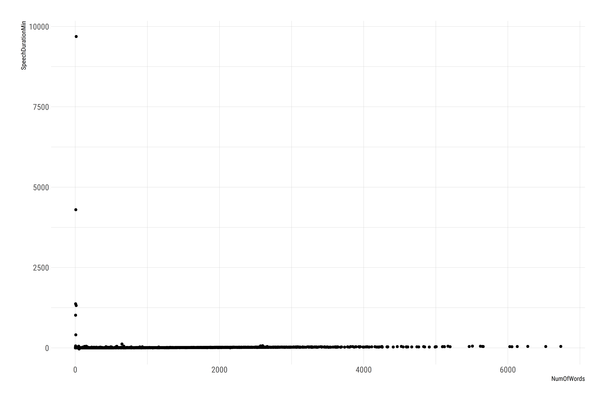
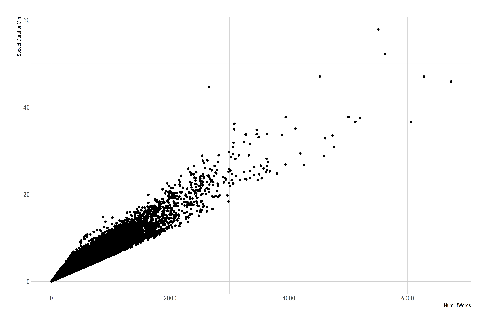
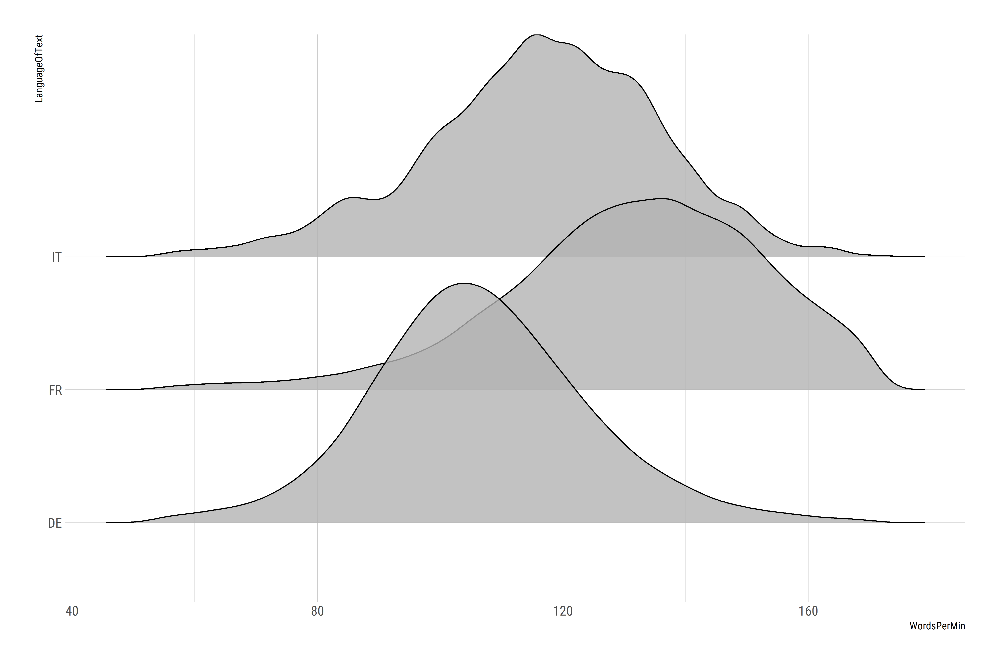
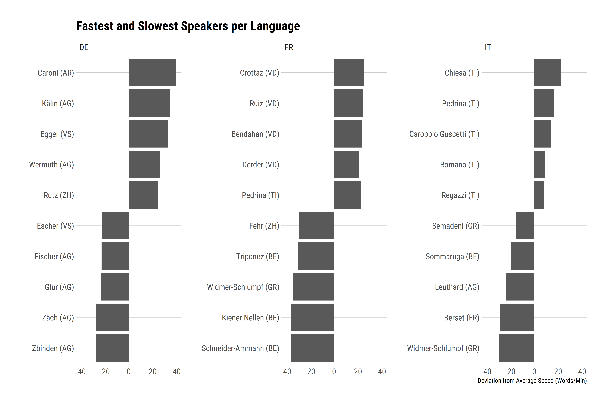
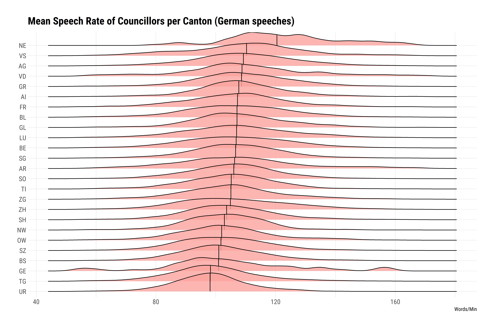
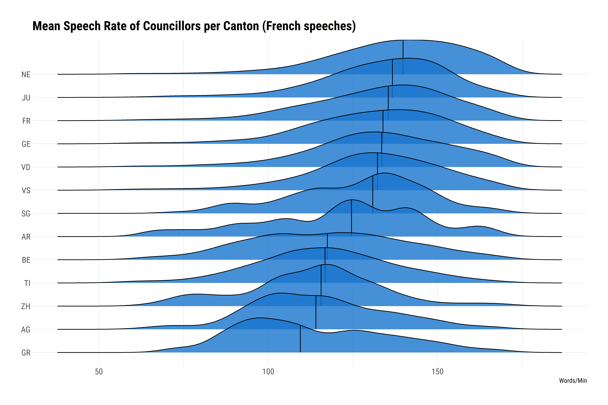
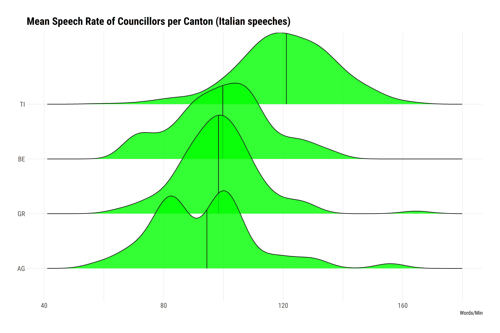

Slow Bernese?
=============

As Switzerland is a federalistic country, Cantons (States) are a rather
important feature. Accordingly, there is quite some competition between
Cantons in all aspects of life. One very controversial point are
languages. There are not just 4 different official languages, but also
huge differences within the part that speaks the same language. One
prominent common belief is that people from the Canton of Berne (the
Capital) are extraordinary slow speakers - especially compared to people
from Zurich (yes, I’m from Zurich). To test this common belief, we will
use speeches from members of the Swiss Parliament, reaching back to
1999.

First we have to download the data, which takes quite some time…

``` r
df <- get_data(table = "Transcript", Language = "DE")
```

## Exploring the Data

To get familiar with the data, we first check who spoke the most since
1999.

``` r
library(dplyr)

df %>%
  group_by(PersonNumber, SpeakerLastName, CouncilName) %>% 
  count() %>%
  ungroup() %>% 
  top_n(20, n) %>% 
  arrange(desc(n)) %>% 
  knitr::kable()
```

|  PersonNumber| SpeakerLastName  | CouncilName |      n|
|-------------:|:-----------------|:------------|------:|
|            NA| NA               | NA          |  43961|
|           488| Leuthard         | Bundesrat   |   3306|
|           512| Sommaruga        | Bundesrat   |   2796|
|          3934| Widmer-Schlumpf  | Bundesrat   |   2496|
|           134| Leuenberger      | Bundesrat   |   2417|
|           277| Bieri            | Ständerat   |   2274|
|           370| Forster-Vannini  | Ständerat   |   2256|
|            50| Couchepin        | Bundesrat   |   2050|
|           372| Inderkum         | Ständerat   |   2025|
|           825| Germann          | Ständerat   |   2022|
|           540| Lombardi         | Ständerat   |   1991|
|            37| Büttiker         | Ständerat   |   1940|
|          1161| Berset           | Bundesrat   |   1831|
|           276| Brändli          | Ständerat   |   1811|
|           508| Schneider-Ammann | Bundesrat   |   1811|
|          1124| de Buman         | Nationalrat |   1805|
|           146| Maurer           | Bundesrat   |   1776|
|           398| Merz             | Bundesrat   |   1770|
|          3916| Hêche            | Ständerat   |   1753|
|            85| Frick            | Ständerat   |   1735|

This is still raw data and not very helpful for our case. First, lets
drop all texts that are not speeches (Type1) and exclude all texts by
presidents of the council, as they speak a lot more than the rest and on
special occasions, which biases the analysis.

``` r
dfs <- df %>%
  filter(Type == 1) %>% 
  filter(!SpeakerLastName == "leer") %>% 
  filter(!SpeakerFunction %in% c("1VP-F", "1VP-M", "2VP-F", "2VP-M", "AP-M", "P-F", "P-M")) %>% 
  filter(!Function %in% c("1VP-M", "2VP-M", "P-F", "p-m", "P-m", "P-M", "P-MM"))
```

Looks a lot better now…

``` r
dfs %>%
  group_by(PersonNumber, SpeakerLastName, CouncilName) %>% 
  count() %>%
  ungroup() %>% 
  top_n(20, n) %>% 
  arrange(desc(n)) %>% 
  knitr::kable()
```

|  PersonNumber| SpeakerLastName        | CouncilName |     n|
|-------------:|:-----------------------|:------------|-----:|
|           488| Leuthard               | Bundesrat   |  3306|
|           512| Sommaruga              | Bundesrat   |  2796|
|          3934| Widmer-Schlumpf        | Bundesrat   |  2496|
|           134| Leuenberger            | Bundesrat   |  2417|
|            50| Couchepin              | Bundesrat   |  2050|
|          1161| Berset                 | Bundesrat   |  1831|
|           508| Schneider-Ammann       | Bundesrat   |  1811|
|           146| Maurer                 | Bundesrat   |  1776|
|           398| Merz                   | Bundesrat   |  1770|
|           487| Leutenegger Oberholzer | Nationalrat |  1438|
|            21| Blocher                | Bundesrat   |  1198|
|           466| Fetz                   | Ständerat   |  1116|
|          1116| Burkhalter             | Bundesrat   |  1077|
|            57| David                  | Ständerat   |   942|
|            58| Deiss                  | Bundesrat   |   929|
|           429| Villiger               | Bundesrat   |   924|
|           379| Wicki                  | Ständerat   |   902|
|           277| Bieri                  | Ständerat   |   815|
|          1122| Fluri                  | Nationalrat |   813|
|           825| Germann                | Ständerat   |   807|

The magic is about to happen. After cleaning the text and free it from
unnecessary remarks, we calculate the duration of the speech, count the
number of words and divide the first by the latter to get [speech
rate](https://www.write-out-loud.com/speech-rate.html) words per minute.
Lastly, we filter all entries that procude NAs in words per minute.

``` r
library(tokenizers)

dfs <- dfs %>%
  mutate(
    Text2 = swissparl::clean_text(Text, keep_round_brackets = F),
    SpeechDurationMin = as.numeric(difftime(End, Start, units = "mins")),
    NumOfWords = count_words(Text2),
    WordsPerMin = NumOfWords / SpeechDurationMin
    ) %>%
  filter(!is.na(WordsPerMin))
```

Let’s check the distribution of *Number of Words* and *Speech Duration*
to see whether our calculations worked.

``` r
# Packages
library(ggplot2)
library(hrbrthemes)

# Scatterplot
dfs %>% 
  ggplot(aes(NumOfWords, SpeechDurationMin)) +
  geom_point() +
  theme_ipsum_rc()
```



Seems like there are some unrealistic values. Let’s have a closer look
at the fastest and slowest speaker and their speeches.

``` r
# Fastest
dfs %>% 
  arrange(desc(WordsPerMin)) %>% 
  select(IdSubject, NumOfWords, SpeechDurationMin, WordsPerMin) %>% 
  slice(1:20) %>% 
  knitr::kable()
```

| IdSubject |  NumOfWords|  SpeechDurationMin|  WordsPerMin|
|:----------|-----------:|------------------:|------------:|
| 15063     |         484|          0.0182667|    26496.351|
| 21019     |         419|          0.0330667|    12671.371|
| 21019     |         426|          0.0565000|     7539.823|
| 46255     |         638|          0.1692667|     3769.201|
| 2405      |         776|          0.2359500|     3288.832|
| 608       |         108|          0.0338833|     3187.408|
| 21019     |          77|          0.0294500|     2614.601|
| 21019     |          64|          0.0250000|     2560.000|
| 25254     |         224|          0.0912167|     2455.692|
| 18048     |         215|          0.1023333|     2100.977|
| 4914      |         237|          0.1223833|     1936.538|
| 6935      |          96|          0.0500000|     1920.000|
| 22738     |         189|          0.0987667|     1913.601|
| 21019     |          58|          0.0333333|     1740.000|
| 6505      |         562|          0.3388333|     1658.633|
| 34607     |         815|          0.5068333|     1608.024|
| 217       |         399|          0.2551667|     1563.684|
| 1491      |         385|          0.2557167|     1505.573|
| 22762     |         261|          0.1767833|     1476.384|
| 21019     |          59|          0.0419333|     1406.995|

``` r
# Slowest
dfs %>% 
  arrange(WordsPerMin) %>% 
  select(IdSubject, NumOfWords, SpeechDurationMin, WordsPerMin) %>% 
  slice(1:20) %>% 
  knitr::kable()
```

| IdSubject |  NumOfWords|  SpeechDurationMin|  WordsPerMin|
|:----------|-----------:|------------------:|------------:|
| 213       |          53|        -31.3060000|   -1.6929662|
| 46124     |          12|       9687.8827333|    0.0012387|
| 46915     |           6|       4301.4335500|    0.0013949|
| 38661     |           3|       1373.3121667|    0.0021845|
| 36014     |           4|       1018.2860500|    0.0039282|
| 40152     |          12|       1319.8989333|    0.0090916|
| 46124     |           7|        408.3947167|    0.0171403|
| 37202     |           3|         61.9845000|    0.0483992|
| 46125     |           2|         40.9251000|    0.0488698|
| 17163     |           4|         28.7405500|    0.1391762|
| 43274     |           1|          3.5910500|    0.2784701|
| 37201     |           1|          3.4094500|    0.2933024|
| 3692      |           1|          2.5661667|    0.3896863|
| 43197     |           1|          1.8215667|    0.5489780|
| 1491      |           3|          3.9611667|    0.7573526|
| 16776     |          47|         52.1074000|    0.9019832|
| 2665      |           3|          3.2271167|    0.9296224|
| 17657     |          33|         30.0277833|    1.0989822|
| 42351     |           1|          0.7871667|    1.2703790|
| 1115      |           4|          3.0943333|    1.2926856|

Seems like keeping track of the speaking time was the *pièce de
résistance*. What irony! In a country famous for its high end, reliable
watches…

### Filtering outliers based on Interquartile Range

``` r
MinSpeed <- quantile(dfs$WordsPerMin, 0.25) - 1.5 * IQR(dfs$WordsPerMin)
MaxSpeed <- quantile(dfs$WordsPerMin, 0.75) + 1.5 * IQR(dfs$WordsPerMin)
 
dfs2 <- dfs %>% 
  filter(WordsPerMin > MinSpeed) %>% 
  filter(WordsPerMin < MaxSpeed)
```

Re-examination of the distribution:

``` r
dfs2 %>% 
  filter(MeetingCouncilAbbreviation == "N") %>% 
  ggplot(aes(NumOfWords, SpeechDurationMin)) +
  geom_point() +
  theme_ipsum_rc()
```



Looks a lot better now…

### Language-Specific Analysis
Let’s have a look at the distribution of speeches over different
languages:

``` r
# Speechs per Language
dfs2 %>% 
  group_by(LanguageOfText) %>% 
  count() %>% 
  mutate(Share = n/nrow(dfs2)) %>% 
  knitr::kable()
```

| LanguageOfText |       n|      Share|
|:---------------|-------:|----------:|
| DE             |  110719|  0.7558333|
| FR             |   34430|  0.2350395|
| IT             |    1176|  0.0080281|
| NA             |     161|  0.0010991|

The use of italian and french mirrors their respective share of the
[Swiss
population](https://www.bfs.admin.ch/bfs/de/home/statistiken/bevoelkerung/sprachen-religionen/sprachen.html)
almost perfectly!

Next step: delete NAs and look at the speech rate per language.

``` r
library(ggridges)

dfs2 %>% 
  filter(!is.na(LanguageOfText)) %>% 
  ggplot(aes(x = WordsPerMin, y = LanguageOfText)) +
  geom_density_ridges(alpha = 0.8) +
  theme_ipsum_rc()
```



As expected, slow german-speaking members, fast speaking representatives
from the french part - and please note this nice normal distribution for
german speeches!

## Speed on Individual Level

Now, let’s have a look at speeds on the individual level.

In a first step, we calculate the average speed per person. To create
greater reliability, we exclude individuals with less than 10 speeches
in a given language. To find the fastet and slowest speaking individuals
we look at their deviation from the mean.

``` r
# Speed per councillor
dfs3 <- dfs2 %>%
  
  # Mean per language
  filter(!is.na(LanguageOfText)) %>% 
  group_by(LanguageOfText) %>% 
  mutate(MeanLanguage = mean(WordsPerMin)) %>% 
  
  # Minimal number of speeches per language
  group_by(PersonNumber, SpeakerLastName, CantonAbbreviation, LanguageOfText) %>%
  mutate(NumberOfSpeeches = n()) %>% 
  ungroup() %>% 
  filter(NumberOfSpeeches > 10) %>% 
  
  # Deviation from mean
  group_by(PersonNumber, SpeakerLastName, CantonAbbreviation, LanguageOfText) %>%
  summarise(
    MeanWordsPerMin = mean(WordsPerMin),
    DevFromLanguageMean = MeanWordsPerMin - mean(MeanLanguage)
    )
  
# Fastest vs. slowest
bind_rows(
  dfs3 %>% 
    group_by(LanguageOfText) %>% 
    top_n(5, MeanWordsPerMin),
  dfs3 %>% 
    group_by(LanguageOfText) %>% 
    top_n(-5, MeanWordsPerMin)
  ) %>% 
  mutate(label = paste0(SpeakerLastName, " (", CantonAbbreviation, ")")) %>% 
  ggplot(aes(reorder(label, DevFromLanguageMean), DevFromLanguageMean)) +
  geom_col() +
  coord_flip() +
  scale_y_continuous(limits = c(-40, 40)) +
  facet_wrap(.~LanguageOfText, scales = "free_y") +
  labs(
    title = "Fastest and Slowest Speakers per Language" ,
    x = "",
    y = "Deviation from Average Speed (Words/Min)"
    ) +
  theme_ipsum_rc() +
  theme(panel.grid.minor = element_blank())
```



## Cantonal Differences

That’s the fun part, how slow are the bernese actually?

### German

``` r
dfs2 %>%
  filter(LanguageOfText == "DE") %>% 
  filter(!is.na(CantonAbbreviation)) %>%
  group_by(CantonAbbreviation) %>% 
  filter(n() > 20) %>% 
  mutate(CantonMedian = median(WordsPerMin)) %>% 
  ungroup() %>% 
  ggplot(aes(x = WordsPerMin, y = reorder(CantonAbbreviation, CantonMedian))) +
  stat_density_ridges(
    quantile_lines = TRUE, 
    quantiles = 2, 
    fill = hrbrthemes::ft_cols$peach, 
    alpha = 0.8
    ) +
  labs(
    title = "Mean Speech Rate of Councillors per Canton (German speeches)" ,
    x = "Words/Min"
    ) +
  theme_ipsum_rc() +
  theme(axis.title.y = element_blank())
```



Bummer! The Bernese representative are about average and even faster
speaking than their colleagues from Zurich. However, in parliament all
representatives speak in standard german and not in their respective
dialects, which probably distorts the values somewhat in favour of the
bernese.

### French

``` r
dfs2 %>%
  filter(LanguageOfText == "FR") %>% 
  filter(!is.na(CantonAbbreviation)) %>%
  group_by(CantonAbbreviation) %>%
  filter(n() > 20) %>% 
  mutate(CantonMedian = median(WordsPerMin)) %>% 
  ungroup() %>% 
  ggplot(aes(x = WordsPerMin, y = reorder(CantonAbbreviation, CantonMedian))) +
  stat_density_ridges(
    quantile_lines = TRUE, 
    quantiles = 2, 
    fill = "dodgerblue3", 
    alpha = 0.8
    ) +
  labs(
    title = "Mean Speech Rate of Councillors per Canton (French speeches)" ,
    x = "Words/Min"
    ) +
  theme_ipsum_rc() +
  theme(axis.title.y = element_blank())
```

 

Too bad, even in french the bernese councillors are faster than 
their counterparts from Zurich.

### Italian

``` r
dfs2 %>%
  filter(LanguageOfText == "IT") %>% 
  filter(!is.na(CantonAbbreviation)) %>%
  group_by(CantonAbbreviation) %>%
  filter(n() > 20) %>% 
  mutate(CantonMedian = median(WordsPerMin)) %>% 
  ungroup() %>% 
  ggplot(aes(x = WordsPerMin, y = reorder(CantonAbbreviation, CantonMedian))) +
  stat_density_ridges(
    quantile_lines = TRUE, 
    quantiles = 2, 
    fill = "green", 
    alpha = 0.8
    ) +
  labs(
    title = "Mean Speech Rate of Councillors per Canton (Italian speeches)" ,
    x = "Words/Min"
    ) +
  theme_ipsum_rc() +
  theme(axis.title.y = element_blank())
```



And finally, they are also using Italian and Zurich’s representatives
not - show-offs! ;)
