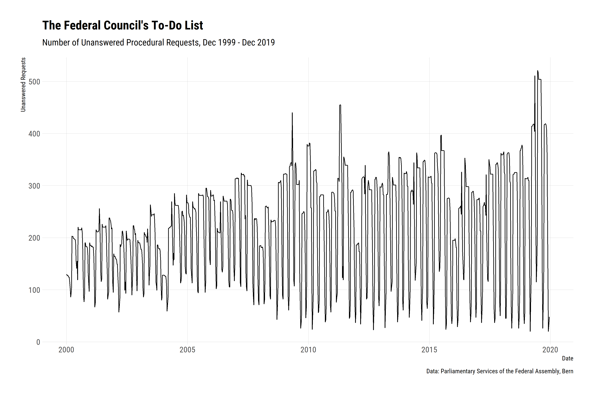
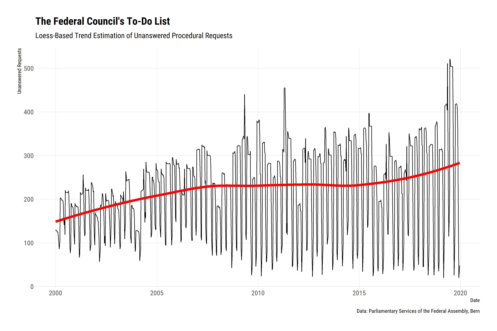
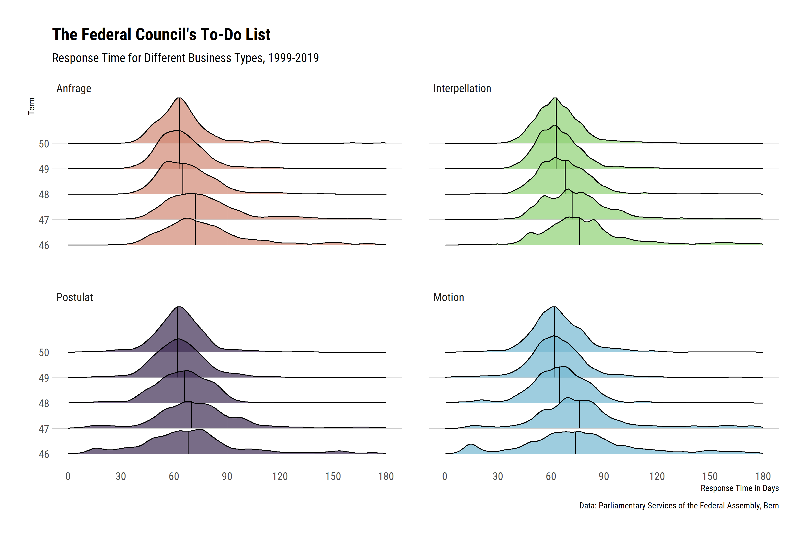
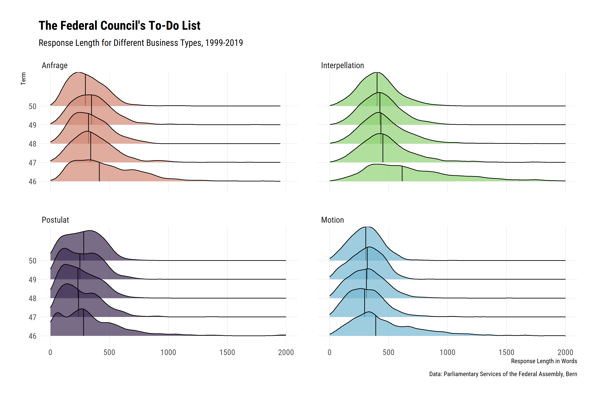
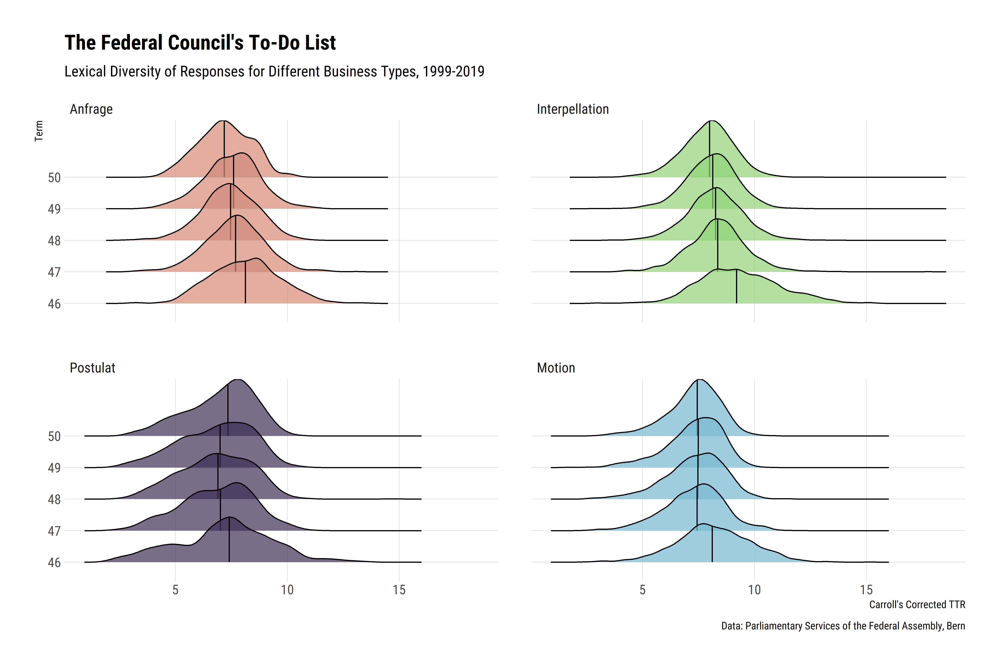

The Federal Council’s To-Do List
================================

The Swiss Parliament has various instruments with which Council members
can provide ideas for new legislation or request information and reports
on a specific topic. These so-called [procedural
requests](https://www.parlament.ch/en/%C3%BCber-das-parlament/parlamentsw%C3%B6rterbuch/parlamentsw%C3%B6rterbuch-detail?WordId=238)
are usually addressed to the Federal Council and must be answered by it.

Let’s find out if we can use the data from the
[Webservices](https://www.parlament.ch/en/services/open-data-webservices)
to determine *how long the Federal Council’s to-do list normally is and
how good the Swiss executive is at processing it*.

We download the entire table *Business* using the function `get_data`.
This may take a few minutes.

``` r
biz <- swissparl::get_data("Business", Language = "DE")
```

The dataset contains the **46,116 businesses** that the Swiss Parliament
has dealt with over the past 20 years. Let’s find out how often the
Federal Council has handled/answered procedural requests since 1999.

``` r
biz %>%
  filter(!is.na(FederalCouncilProposal)) %>% 
  group_by(BusinessTypeName) %>% 
  count() %>% 
  arrange(desc(n)) %>% 
  knitr::kable()
```

| BusinessTypeName            |      n|
|:----------------------------|------:|
| Interpellation              |  11049|
| Motion                      |   8922|
| Postulat                    |   4283|
| Anfrage                     |   2001|
| Einfache Anfrage            |   1112|
| Dringliche Interpellation   |    215|
| Dringliche Einfache Anfrage |    181|
| Dringliche Anfrage          |     82|
| Empfehlung                  |     73|
| Fragestunde. Frage          |      2|

**Quite a workload!**

Now we are interested in how good the Federal Council was at working
this pile off? For this purpose, we define a function that determines at
any given time how many requests the Federal Council has not yet
answered.

``` r
get_unanswered_requests <- function(date, dt) {
  
  dt %>% 
    mutate(open = ifelse(date >= SubmissionDate & date < FederalCouncilProposalDate, 1, 0)) %>% 
    group_by(open) %>% 
    count() %>% 
    ungroup() %>% 
    mutate(Date = date) %>%
    filter(open == 1) %>%
    select(Date, n)
  
} 
```

Length of the To-Do List
------------------------

We now apply this function to our data in a *weekly* rhythm (always on
Sundays). Unanswered requests are no longer taken into account after one
year.

``` r
# All Sundays from 2000 to today
sundays <- seq.Date(lubridate::ymd("2000-01-02"), Sys.Date(), "week")

# Dataset 
requests <- biz %>%
  filter(BusinessTypeName %in% c("Interpellation", "Motion", "Postulat")) %>% 
  mutate(FederalCouncilProposalDate = ifelse(is.na(FederalCouncilProposalDate), SubmissionDate + 365, FederalCouncilProposalDate))

# Unanswered requests  
unanswered_requests <- purrr::map_dfr(sundays, get_unanswered_requests, dt = requests)

# Plot
library(tsbox)
library(ggplot2)
library(hrbrthemes)

unanswered_requests %>% 
  ts_ggplot() + 
  labs(
    title = "The Federal Council's To-Do List",
    subtitle = "Number of Unanswered Procedural Requests, Dec 1999 - Dec 2019",
    caption = "Data: Parliamentary Services of the Federal Assembly, Bern",
    y = "Unanswered Requests"
    ) +
  theme_ipsum_rc() +
  theme(panel.grid.minor = element_blank())
```



It’s oscillating pretty strong. Let’s see if there’s a trend.

``` r
unanswered_requests %>% 
  ts_trend %>% 
  ts_ggplot() +
  scale_y_continuous(limits = c(0, 300)) +
  labs(
    title = "The Federal Council's To-Do List",
    subtitle = "Loess-Based Trend Estimation of Unanswered Procedural Requests",
    caption = "Data: Parliamentary Services of the Federal Assembly, Bern",
    y = "Unanswered Requests"
    ) +
  theme_ipsum_rc() +
  theme(panel.grid.minor = element_blank())
```



Response Time
-------------

Not surprisingly, there is a trend. After all, the number of requests
has increased steadily over the last few years. Has this had an impact
on the duration required by the Federal Council to respond to the
councillors’ demands?

``` r
library(lubridate)
library(ggridges)

# Data prep
biz2 <- biz %>% 
  mutate(ResponseTime = as.numeric(FederalCouncilProposalDate - SubmissionDate)) %>% 
  
  # Filtering out unrealistic values
  filter(ResponseTime > 0) %>% 
  filter(ResponseTime < 365) %>% 
  
  # Focusing on phase with full coverage...
  filter(year(SubmissionDate) > 1999) %>% 
  
  # ...and the most common request types
  mutate(BusinessTypeName = ifelse(BusinessTypeName == "Einfache Anfrage", "Anfrage", BusinessTypeName)) %>% 
  filter(BusinessTypeName %in% c("Motion", "Postulat", "Interpellation", "Anfrage")) %>% 
  mutate(BusinessTypeName = factor(BusinessTypeName, levels = c("Anfrage", "Interpellation", "Postulat", "Motion"))) 
  
# Plot
biz2 %>% 
  ggplot(aes(x = ResponseTime, y = as.factor(SubmissionLegislativePeriod), fill = BusinessTypeName)) +
  stat_density_ridges(quantile_lines = TRUE, quantiles = 2, alpha = 0.7) +
  scale_x_continuous(limits = c(0, 180), breaks = seq(0, 180, by = 30)) +
  facet_wrap(.~BusinessTypeName) +
  labs(
    title = "The Federal Council's To-Do List",
    subtitle = "Response Time for Different Business Types, 1999-2019",
    caption = "Data: Parliamentary Services of the Federal Assembly, Bern",
    x = "Response Time in Days",
    y= "Term"
  ) +
  scale_fill_ipsum() +
  theme_ipsum_rc() +
  theme(
    legend.position = "none",
    panel.grid.minor = element_blank()
    )
```



The response time does not seem to have increased despite the greater
workload. On the contrary, it seems that the Federal Council has become
**more efficient** in the last two decades. *What influence did this
have on the length and the complexity of the answers?*

Response Length
---------------

``` r
library(tokenizers)

# Data prep
biz2 %>% 
  filter(!is.na(FederalCouncilResponseText)) %>% 
  mutate(AnswerLength = lengths(tokenize_words(swissparl::clean_text(FederalCouncilResponseText)))) %>% 
  
  # Plot
  ggplot(aes(x = AnswerLength, y = as.factor(SubmissionLegislativePeriod), fill = BusinessTypeName)) +
  stat_density_ridges(quantile_lines = TRUE, quantiles = 2, alpha = 0.7) +
  scale_x_continuous(limits = c(0, 2000), breaks = seq(0, 2000, by = 500)) +
  facet_wrap(.~BusinessTypeName) +
  labs(
    title = "The Federal Council's To-Do List",
    subtitle = "Response Length for Different Business Types, 1999-2019",
    caption = "Data: Parliamentary Services of the Federal Assembly, Bern",
    x = "Response Length in Words",
    y = "Term"
  ) +
  scale_fill_ipsum() +
  theme_ipsum_rc() +
  theme(
    legend.position = "none",
    panel.grid.minor = element_blank()
    )
```



On average, the Federal Council’s responses appear to have been somewhat
shorter for 3 out of 4 types. However, the difference between the
legislative periods is marginal.

Response Complexity
-------------------

``` r
library(quanteda)

# Lexical diversity
biz2$LexicalDiversity <- biz2 %>%
  pull(FederalCouncilResponseText) %>% 
  swissparl::clean_text() %>%
  tokens("word") %>%
  textstat_lexdiv("CTTR") %>%
  pull(CTTR)

# Plot
biz2 %>% 
  ggplot(aes(x = LexicalDiversity, y = as.factor(SubmissionLegislativePeriod), fill = BusinessTypeName)) +
  stat_density_ridges(quantile_lines = TRUE, quantiles = 2, alpha = 0.7) +
  facet_wrap(.~BusinessTypeName) +
  labs(
    title = "The Federal Council's To-Do List",
    subtitle = "Lexical Diversity of Responses for Different Business Types, 1999-2019",
    caption = "Data: Parliamentary Services of the Federal Assembly, Bern",
    x = "Carroll's Corrected TTR",
    y = "Term"
    ) +
  scale_fill_ipsum() +
  theme_ipsum_rc() +
  theme(
    legend.position = "none",
    panel.grid.minor = element_blank()
    )
```



Same picture with the complexity of the responses. Hardly any change
over the years. An in-depth analysis would now be necessary to get to
the bottom of the matter.

But for now, we can say that **the Federal Council seems to be dealing
well** with the increased number of requests and businesses.
