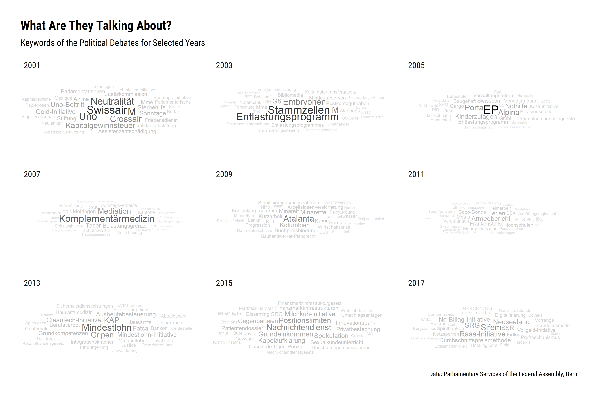

What Are They Talking About?
============================

Politicians talk a lot. *But how do we find out what the most important
topics were?* The linguistic concept of
[keyness](https://en.wikipedia.org/wiki/Keyword_(linguistics)) can serve
as a simple starting point here. **Keyness** is the value for the
statistical significance of the frequency of a word in a given corpus,
related to a reference corpus. Let’s take a look at this for the past
years.  
We’re downloading all the transcripts of the speeches (`Type = 1`
prevents the download of notes on votes and other processes). For the
sake of simplicity, we will only consider speeches in German during the
analysis. The download still may take a few hours.

``` r
df <- swissparl::get_data(
    table = "Transcript",
    Language = "DE",
    Type = 1,
    LanguageOfText = "DE"
    )
```

Now we exclude all transcripts that come from Council Presidents and
Vice-Presidents and then clean the texts with the help function
`swissparl::clean_text`.

``` r
# Package
library(dplyr)

# Data prep
dfs <- df %>%
    filter(!SpeakerLastName == "leer") %>% 
    filter(!SpeakerFunction %in% c("1VP-F", "1VP-M", "2VP-F", "2VP-M", "AP-M", "P-F", "P-M")) %>% 
    filter(!Function %in% c("1VP-M", "2VP-M", "P-F", "p-m", "P-m", "P-M", "P-MM")) %>% 
    mutate(Text2 = swissparl::clean_text(Text, keep_round_brackets = F))
```

Document-Feature Matrix
-----------------------

With the help of the awesome [quanteda](https://quanteda.io/index.html)
package, we convert the almost ~112,000 speeches into a
[document-feature
matrix](https://tutorials.quanteda.io/basic-operations/dfm/). This
matrix then serves as the starting point for all further analyses.

``` r
# Packages
library(quanteda)
library(stringr)

# Create dfm
dfms <- corpus(
    dfs$Text2,
    docnames = dfs$ID,
    docvars = dfs %>% select(-Text, -Text2)
    ) %>%
    dfm(
      tolower = F,
      remove = str_replace_all(stopwords("de"), "ß", "ss"),
      remove_punct = T
      )
```

Custom Function
---------------

Now we’re building a function that allows us to find out for a given
year what the central keywords were compared to the rest of our corpus.

``` r
get_keyness_per_year <- function(year, n = 30, nouns.only = T, no.names = T, dfm) {
      
    # Install package
    if (!require(lubridate)) install.package("lubridate")
      
    # Feedback
    cat(paste0("processing: '", year, "'\n"))

    # Keywords
    res <- quanteda::textstat_keyness(
        x = dfm,
        target = lubridate::year(quanteda::docvars(dfm)[["Start"]]) == year
        )
      
    # Only nouns
    if (nouns.only) res <- res %>% filter(!feature == tolower(feature)) 
      
    # No names
    if (no.names) res <- res %>% filter(!feature %in% c(quanteda::docvars(dfm)[["SpeakerLastName"]], quanteda::docvars(dfm)[["SpeakerFirstName"]])) 

    # Top N
    res %>% 
       dplyr::slice(1:n) %>% 
       dplyr::select(feature, chi2) %>% 
       dplyr::mutate(year = year)

    }
```

We then apply this function to selected years and extract the 30 words
with the highest keyness (*chi-squared test*)…

``` r
keywords <- purrr::map_dfr(
    c(2001, 2003, 2005, 2007, 2009, 2011, 2013, 2015, 2017), 
    get_keyness_per_year, 
    dfm = dfms
    )
``` 

…and plot the results as wordclouds:

``` r
# Packages
library(ggplot2)
library(hrbrthemes)
library(ggwordcloud)

# Plot
keywords %>%
     ggplot(aes(label = feature, size = chi2, alpha = 0.05 * chi2)) +
     geom_text_wordcloud() +
     labs(
       title = "What Are They Talking About?",
       subtitle = "Keywords of the Political Debates for Selected Years",
       caption = "Data: Parliamentary Services of the Federal Assembly, Bern"
     ) +
     facet_wrap(year~.) +
     theme_ipsum_rc()
```



Comparison 2018/2019
--------------------

Finally, we want to compare the last two years directly: We subset the
dfm and then apply our function again.

``` r
# Data 
dfms2 <- dfms %>% 
    dfm_subset(year(docvars(dfms)[["Start"]]) %in% c(2018, 2019))

# Get 50 Keywords 
keywords2 <- purrr::map_dfr(c(2018, 2019), get_keyness_per_year, n = 50, dfm = dfms2)

# Plot
keywords2 %>%
     ggplot(aes(label = feature, size = chi2, alpha = 0.05 * chi2)) +
     geom_text_wordcloud() +
     scale_size_area(max_size = 14) +
     labs(
       title = "What Are They Talking About?",
       subtitle = "Keywords of the Political Debates, 2018 vs. 2019",
       caption = "Data: Parliamentary Services of the Federal Assembly, Bern"
      ) +
      facet_wrap(year~.) +
      theme_ipsum_rc()
```


For further analysis, it is advisable to consider the field and the
methods of [topic models](https://en.wikipedia.org/wiki/Topic_model).
