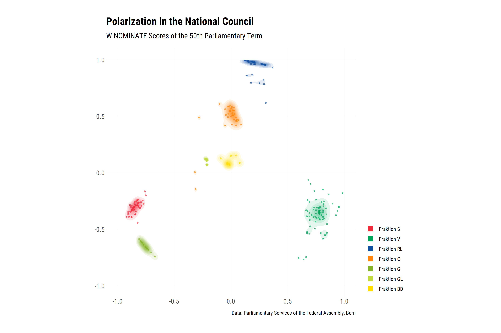
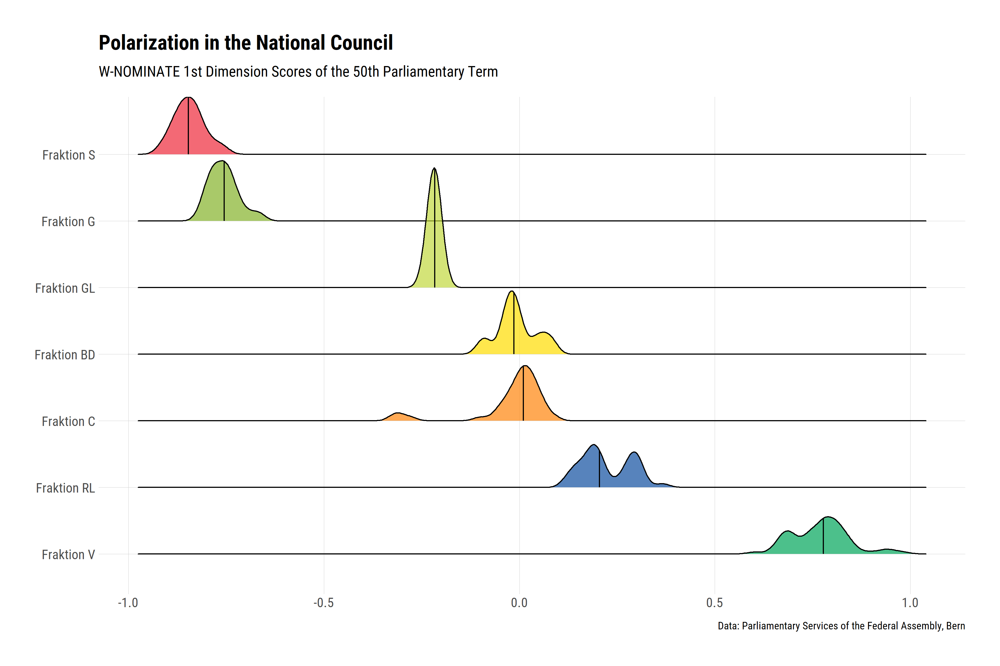

Polarization in the National Council
====================================

In political science, various dimensionality reduction methods are used
to derive polarization patterns from voting data. The best known scaling
method is probably
[(D)W-NOMINATE](https://en.wikipedia.org/wiki/NOMINATE_(scaling_method)),
whose predecessor NOMINATE (*Nominal Three-Step Estimation*) was
developed in the 1980s. *We want to use this procedure to examine how
polarised the National Council was in the 50th legislative period.*

Data Download
-------------

Since large queries can lead to server-side errors that result in the
loss of all data already downloaded, we fetch the voting data step
stepwise and combine the locally stored files after the download.

For this purpose we use the following function:

``` r
get_voting_buffered <- function(id) {
  
  # Create folder
  folder <- "voting50"
  if(!dir.exists(folder)) dir.create(folder)
  
  # Download
  dt <- swissparl::get_data("Voting", Language = "DE", IdSession = id)
  
  # Save
  saveRDS(dt, paste0(folder, "/", id, ".rds"))
  
}
```

It is applied using `purrr`’s `walk` function to all sessions of the
50th term.

``` r
# Get Session IDs
sessions50 <- swissparl::get_data("Session", Language = "DE", LegislativePeriodNumber = 50)

# Apply Function to Session IDs
purrr::walk(sessions50$ID, get_voting_buffered)

# Combine to One Dataset
v50 <- purrr::map_dfr(list.files("voting50", full.names = T), readRDS)
```

We find **~893,000 entries**. These are now extended to include further
information on the members of the Council.

``` r
# Get Councillor Data
council_members <- swissparl::get_data(
  table = "MemberCouncil", 
  Language = "DE", 
  PersonNumber = unique(v50$PersonNumber)
  )

# Join with Voting Data
v50 <- left_join(
  v50,
  council_members %>% 
    select(PersonNumber, GenderAsString, CantonAbbreviation, PartyAbbreviation),
  by = "PersonNumber"
)
```

Data Preparation
----------------

Before we can analyze our data with the NOMINATE scaling method, we have
to convert it into an object of the class `rollcall`. For this we use
the package `pscl`…this may take a little getting used to.

``` r
# Load Packages
library(pscl)
library(dplyr)
library(tidyr)

# Wide Form
v50w <- v50 %>%
  mutate(ID = paste0(LastName, " (", ParlGroupNameAbbreviation, "/", CantonAbbreviation, ")" )) %>% 
  select(ID, GenderAsString, ParlGroupNameAbbreviation, PartyAbbreviation, IdVote, Decision) %>% 
  mutate(Decision_new = case_when(
    Decision == 1 ~ 1,
    Decision == 2 ~ 6,
    !Decision %in% c(1, 2) ~ 9
    )
  ) %>%
  select(-Decision) %>% 
  pivot_wider(names_from = IdVote, values_from = Decision_new)

# Generate rcObject
rc50 <- rollcall(
  data = v50w %>% select(-(1:4)),
  yea = 1,
  nay = 6,
  missing = 9,
  notInLegis = NA,
  legis.names = v50w$ID,
  vote.names = names(v50w %>% select(-(1:4))),
  legis.data = v50w %>% select(2:4)
)
```

Poole and Rosenthal's W-NOMINATE
--------------------------------

To calculate the relative positions of the politicians on 2 dimensions
we use W-NOMINATE from Poole and Rosenthal. The algorithm is implented
in the R-Package `wnominate`. The calculation takes about 10-15 minutes.

``` r
library(wnominate)

res <- wnominate::wnominate(
  rcObject = rc50, 
  minvotes = ceiling(0.25 * length(unique(v50$IdVote))),
  polarity = c("Wobmann (Fraktion V/SO)", "Wobmann (Fraktion V/SO)")
)
```

Political Landscape of the National Council
-------------------------------------------

We now use the calculated coordinates to visualize the political
polarization in the National Council in the 50th legislative period.

``` r
# Packages
library(ggplot2)
library(hrbrthemes)

# 2D-Plot
res$legislators %>%
  mutate(ParlGroupNameAbbreviation = factor(
    ParlGroupNameAbbreviation,
    levels = c("Fraktion S", "Fraktion V", "Fraktion RL", "Fraktion C", "Fraktion G", "Fraktion GL", "Fraktion BD")
    )
  ) %>% 
  ggplot(aes(x = coord1D, y = -coord2D)) +
  stat_density_2d(
    aes(alpha = stat(level), fill = ParlGroupNameAbbreviation), 
    geom = "polygon", 
    show.legend = FALSE
    ) +
  geom_point(
    aes(color = ParlGroupNameAbbreviation), 
    alpha = 0.6, 
    size = 1
    ) +
  expand_limits(x = c(-1, 1), y = c(-1, 1)) +
  coord_equal() +
  scale_fill_manual(values = c("#EE2A3B", "#00A55A", "#104FA0", "#FF850C", "#85B229", "#C2D93F", "#FFDD00")) +
  scale_color_manual(
    values = c("#EE2A3B", "#00A55A", "#104FA0", "#FF850C", "#85B229", "#C2D93F", "#FFDD00"),
    guide = guide_legend(override.aes = list(shape = 15, size = 4, alpha = 1))
    ) +
  labs(
    title = "Polarization in the National Council",
    subtitle = "W-NOMINATE Scores of the 50th Parliamentary Term",
    caption = "Data: Parliamentary Services of the Federal Assembly, Bern",
    color = ""
  ) +
  theme_ipsum_rc() +
  theme(
    legend.justification = "bottom",
    axis.title = element_blank(),
    panel.grid.minor = element_blank()
    )
```



Quite homogeneous parliamentary groups. Let’s now foucs on the first
W-NOMINATE dimension (left-right spectrum).

``` r
# Package
library(ggridges)

# 1D-Plot
res$legislators %>%
  mutate(ParlGroupNameAbbreviation = factor(
    ParlGroupNameAbbreviation,
    levels = rev(c("Fraktion S", "Fraktion G", "Fraktion GL", "Fraktion BD", "Fraktion C", "Fraktion RL", "Fraktion V"))
    )
  ) %>% 
  ggplot(aes(x = coord1D, y = ParlGroupNameAbbreviation, fill = ParlGroupNameAbbreviation)) +
  stat_density_ridges(quantile_lines = TRUE, quantiles = 2, alpha = 0.7) +
  scale_fill_manual(values = rev(c("#EE2A3B", "#85B229", "#C2D93F", "#FFDD00", "#FF850C", "#104FA0", "#00A55A"))) +
  labs(
    title = "Polarization in the National Council",
    subtitle = "W-NOMINATE 1st Dimension Scores of the 50th Parliamentary Term",
    caption = "Data: Parliamentary Services of the Federal Assembly, Bern"
  ) +
  theme_ipsum_rc() +
  theme(
    legend.position = "none",
    axis.title = element_blank(),
    panel.grid.minor = element_blank()
    )
```



For a more elaborate analysis check out Clau Dermont’s [Aus bipolar wird
tripolar: Polarisierung bei
Parlamentsabstimmungen](https://www.zora.uzh.ch/id/eprint/169808/1/190326_dermont_polarisierung_docu.pdf).
